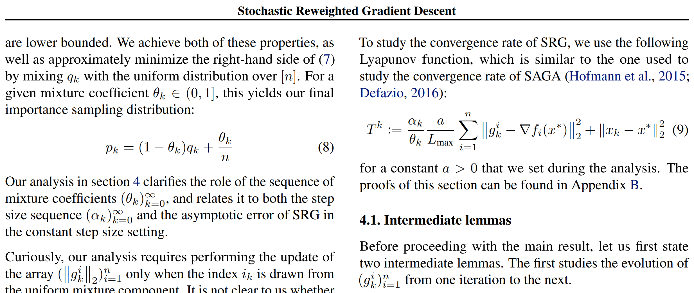

LaTeX sources for the [Two-Tailed
Averaging](https://arxiv.org/abs/2209.12581) paper.

The trouble with reading [The Elements of Typographic
Style](https://en.wikipedia.org/wiki/The_Elements_of_Typographic_Style)
by Robert Bringhurst is that you will see things that you didn't
before. One of these things is misaligned baselines on opposing pages
of a book or on column of the same page.

This repository serves as a demonstration of how to use
[ground.sty](ground.sty) and [mglgrid.sty](mglgrid.sty) for [grid
typesetting](https://24ways.org/2006/compose-to-a-vertical-rhythm).
These packages are not finished libraries, and they will probably
never be because of how invasive this kind of thing is in LaTeX.
Nevertheless, they may serve as a good starting point for people set
on making baselines line up.

Have a look at the paper with the [xcharter](samples/xcharter.pdf)
font, the [same thing with layout
debugging](samples/xcharter-with-debug-layout.pdf), or with [Times New
Roman](samples/times-new-roman.pdf). Here is a quick sample with
layout debugging:

There are existing LaTeX packages such as
[grid](https://ctan.org/pkg/grid) and
[gridset](https://ctan.org/pkg/gridset), but `grid` didn't work at all
for me and `gridset` requires many recompilations.
